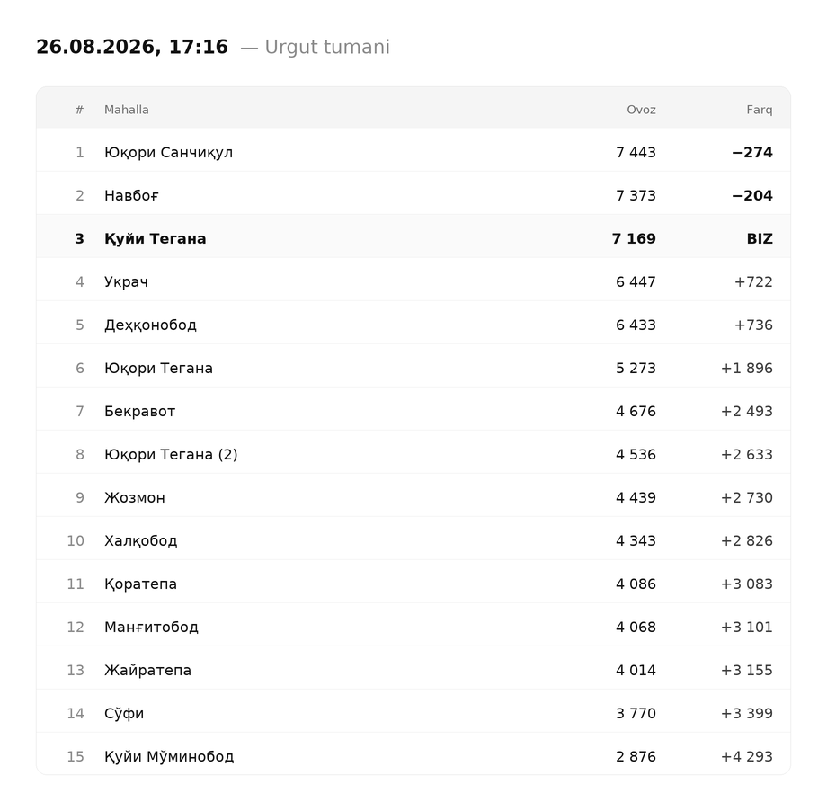

# OpenBudget monitoring boti

`new.openbudget.uz` dagi "Tashabbusli budjet" ovoz berishini kuzatadi va har
30 daqiqada reyting jadvalini **PNG rasm** ko'rinishida Telegram guruhga
yuboradi. Rasmga Groq generatsiya qilgan qisqa tahlil caption sifatida qo'shiladi.



---

## Nima qiladi

1. Tuman bo'yicha **barcha** tashabbuslarni oladi (Urgut — 268 ta)
2. Ovoz bo'yicha saralab **TOP-15** ni ajratadi
3. Har bir snapshot'ni SQLite ga yozadi → 30 daqiqalik va 24 soatlik **delta**
4. Jadvalni rasm qilib chizadi (Pillow, 920px, 2x retina)
5. Groq'dan 2 ta qisqa kuzatuv jumlasi oladi
6. `sendPhoto` orqali guruhga yuboradi

Qo'shimcha: o'rin o'zgarsa ogohlantiradi, kechasi (01:00–06:00) xabar
yubormaydi, lekin ma'lumot yig'ishda davom etadi.

---

## Tez boshlash

```bash
git clone <repo> && cd openbudget-bot
python -m venv .venv && source .venv/bin/activate   # Windows: .venv\Scripts\activate
pip install -r requirements.txt
cp .env.example .env        # va .env ni to'ldiring
python bot.py --once --dry-run    # test: yubormasdan tekshirish
python bot.py                     # doimiy ishlash
```

---

## `.env` sozlamalari

| O'zgaruvchi | Ma'nosi | Sukut |
|---|---|---|
| `BOT_TOKEN` | @BotFather bergan token | — |
| `CHAT_ID` | Guruh id si (`-100...`) | — |
| `GROQ_API_KEY` | console.groq.com dan | — |
| `GROQ_MODEL` | Model nomi | `qwen/qwen3.8-27b` |
| `PROJECT_ID` | Kuzatiladigan loyiha `publicId` si | `055530954008` |
| `INTERVAL_MINUTES` | Tekshirish oralig'i | `30` |
| `QUIET_START` / `QUIET_END` | Jim soatlar (Toshkent vaqti) | `1` / `6` |
| `TOP_N` | Jadvaldagi qatorlar soni | `15` |
| `REGION_ID` / `DISTRICT_ID` | Viloyat / tuman | `8` / `93` |
| `SCRAPER_MODE` | `auto` \| `api` \| `playwright` | `auto` |
| `MAX_RETRIES` | Qayta urinishlar | `3` |

### ⚠️ PROJECT_ID haqida

Texnik topshiriqda `055490954008` ID si ko'rsatilgan edi, lekin bazada bunday
yozuv **yo'q**. "Quyi tegana Mahallasidagi H,Boyaqaro va Bobir 1 ko'chalarini
asfaltlash" loyihasining haqiqiy `publicId` si — **`055530954008`**. Sukut
bo'yicha shu qo'yilgan.

Boshqa loyihaga o'tish uchun ID ni saytdagi kartochkadan oling
("ID: 0554...") va `.env` ga yozing. Bot loyihani **faqat ID bo'yicha**
qidiradi — nom o'zgarsa ham topaveradi.

---

## Bot tokenini olish

1. Telegramda [@BotFather](https://t.me/BotFather) ga yozing
2. `/newbot` → bot nomi va username ni kiriting
3. Bergan tokenni `.env` dagi `BOT_TOKEN` ga qo'ying

## Botni guruhga qo'shish

1. Guruh → **Add members** → bot username ini qidiring va qo'shing
2. Guruh sozlamalari → **Administrators** → **Add admin** → botni tanlang
3. Kamida **Post messages** huquqini bering

> Bot admin bo'lmasa guruhga rasm yubora olmaydi.

## `chat_id` ni topish

**1-usul (eng oson).** Botni guruhga qo'shing, guruhda biror xabar yozing, so'ng:

```bash
curl "https://api.telegram.org/bot<TOKEN>/getUpdates"
```

Javobdagi `"chat":{"id":-1001234567890,...}` — o'sha `-100...` raqami sizning
`CHAT_ID` ingiz.

**2-usul.** Guruhga [@userinfobot](https://t.me/userinfobot) ni qo'shing —
u chat id ni ko'rsatadi, keyin uni o'chirib yuboring.

> Supergroup id si **doim** `-100` bilan boshlanadi. Minus belgisini
> tushirib qoldirmang.

---

## Ishga tushirish rejimlari

```bash
python bot.py                      # doimiy (har INTERVAL_MINUTES daqiqada)
python bot.py --once               # bir marta, Telegramga yuboradi
python bot.py --once --dry-run     # bir marta, yubormaydi — caption terminalga
python bot.py --render-only        # faqat rasm chizadi -> test_output.png
python bot.py --render-only -o a.png
python scraper.py                  # faqat ma'lumot: TOP-15 ni terminalga
python selftest.py                 # 40 ta ichki tekshiruv (tarmoqsiz)
```

---

## Ma'lumot manbasi

Sayt Nuxt (Vue) SPA — HTML da ma'lumot yo'q. Ichki JSON API DevTools >
Network orqali topilgan:

```
GET /api/v2/info/board/55?stage=PASSED&page=N&size=50&regionId=8&districtId=93
```

Javob Spring Data `Page` ko'rinishida: `content[]`, `totalElements`, `last`.

Muhim nuanslar:

* `size` so'ralganidan qat'i nazar serverda **36** ga cheklanadi →
  `last=true` bo'lguncha aylanish kerak
* API **ovoz bo'yicha saralab bermaydi** → barcha 268 ta yozuv olinib,
  mahalliy tarzda saralanadi
* `districtId` ni `/api/v1/districts?offset=N&limit=100` dan olish mumkin
  (bu endpoint `page`/`size` emas, `offset`/`limit` bilan sahifalanadi)

**Playwright zaxirasi.** Agar API to'g'ridan-to'g'ri javob bermay qolsa
(Cloudflare, JS-gate), `SCRAPER_MODE=auto` bilan bot headless chromium'da
sahifani ochib, o'sha API ni sahifa kontekstidan chaqiradi:

```bash
pip install playwright && playwright install chromium
```

---

## Rasm nima uchun Pillow bilan chiziladi

HTML+CSS yozib Playwright bilan screenshot qilish ham mumkin edi, lekin:

| | Pillow | HTML + Playwright |
|---|---|---|
| Docker image | ~150 MB | ~650 MB (chromium) |
| Bir rasm | ~80 ms | ~1.5 s + 200 MB RAM |
| Natija barqarorligi | har joyda bir xil | chromium versiyasiga bog'liq |

Jadval 4 ustunli va tekis — CSS ning ustunligi bu yerda sezilmaydi. Pillow'da
raqamlar piksel darajasida o'lchanib o'ngga tekislanadi, shuning uchun
`tabular-nums` shrift xususiyatiga tayanish shart emas.

### Shrift

`fonts/` papkasida **DejaVu Sans** (Regular + Bold) bor. Tizim shriftiga
tayanilmaydi. DejaVu o'zbek kirill harflarini to'liq qoplaydi: `Ў ў Ғ ғ Ҳ ҳ Қ қ`,
shuningdek `−` (U+2212 minus).

Boshqa shriftga almashtirish: `fonts/` ga `.ttf` fayllarni qo'ying va
`renderer.py` dagi `_font()` funksiyasidagi nomlarni o'zgartiring.

---

## Rasm dizayni

* Oq fon, 40px chekka bo'shliq, kenglik 920px
* Jadval: 12px yumaloq burchak, `#E5E5E5` chegara
* Sarlavha qatori `#F5F5F5`, qatorlar orasida `#EEEEEE` chiziq
* Qator balandligi 48px, 2x chizilib 1x ga siqiladi (retina)
* **Farq** ustuni bizning ovozga nisbatan:
  * yuqoridagilar — manfiy, **qalin qora** (`−274`)
  * biz — **BIZ**, butun qator qalin
  * pastdagilar — musbat, oddiy (`+722`)
* Minus belgisi — U+2212 (`−`), oddiy defis emas
* Bir xil mahalla nomi takrorlansa `(2)`, `(3)` qo'shiladi
* Loyiha TOP-15 dan tushib qolsa — jadval oxiriga alohida qator bo'lib qo'shiladi

---

## Caption tuzilishi

```
🌙 Kechasi (01:00–06:00): biz +120, eng faol raqib +250   ← faqat ertalab
⬆️ O'RIN O'ZGARDI: 4 → 3                                  ← faqat o'zgarganda

📍 BIZ: 3-o'rin · 7 173 ovoz

⬆️ OLDINDA
Navbog' +204
Yuqori Sanchiqul +276

⬇️ ORTDA
Ukrach −724
Dehqonobod −734

🔥 KIM HARAKAT QILYAPTI (30 daq)
10. Xalqobod +58
8. Yuqori Tegana +56
15. Quyi Mo'minobod +52
14. So'fi +51
11. Qoratepa +35
3. BIZ +4
...yana 8 ta
Qimirlamadi: 1 ta mahalla

TOP-15 da Xalqobod 58 ovoz bilan yetakchilik qilyapti.

Ukrach bizdan 724 ovoz ortda qolmoqda.

🕘 18:06 · biz +4 · tumanda jami +443
```

Bloklar bo'sh qator bilan ajratilgan. "🔥 KIM HARAKAT QILYAPTI" TOP-15 ichida
so'nggi yarim soatda ovoz olganlarni ko'rsatadi; **bizning qator har doim
ro'yxatda bo'ladi**, hatto eng faol oltilikka kirmasak ham — guruh o'zini
boshqalar bilan solishtira olishi kerak.

Faktlar bloki (📍⬆️⬇️🔥) **kodda hisoblanadi** — Groq ishlamasa ham joyida
qoladi. Mahalla nomlari caption'da lotinga o'giriladi (`to_latin`), rasmda esa
saytdagidek kirillcha qoladi.

Oxirgi qator — yangilanish holati. Sayt ovozlarni real vaqtda emas, to'p-to'p
yangilaydi, shuning uchun "saytda o'zgarish yo'q" holati alohida yoziladi:
busiz turib qolgan sayt bilan qotib qolgan botni farqlab bo'lmaydi.

## Groq tahlili

`ai.py` Groq'ga faqat raqamlarni yuboradi va **2 ta qisqa kuzatuv jumlasi**
oladi. `max_tokens=200`, `temperature=0.3`.

Prompt qat'iy chegaralangan, chunki erkin qo'yilganda model:

* umumiy gap yozadi ("barqaror turibmiz", "e'tibor qaratish kerak")
* `oxirgi_30_daqiqa` ni "30 kun" deb o'qiydi
* "eng faol" bilan "eng yaqin raqib" ni chalkashtiradi
* bema'ni tavsiya beradi ("raqib mahallaga ovoz yuboring")

Shuning uchun: tavsiya so'ralmaydi (faqat kuzatuv), buyruq fe'llari
taqiqlangan, eng yaqin qo'shni va eng faol uchtalik `bot.py` da oldindan
hisoblab beriladi. **Hech narsa o'zgarmagan bo'lsa Groq umuman chaqirilmaydi** —
aytadigan gapi yo'q, faktlar bloki o'zi yetarli.

Jumlalar `paragraphs()` orqali alohida qatorlarga bo'linadi — bu prompt'ga
emas, kodga bog'liq, shuning uchun model qanday yozsa ham natija bir xil.

Model topilmasa avtomatik zaxiraga o'tadi:
`qwen/qwen3.8-27b` → `llama-3.1-8b-instant` → `openai/gpt-oss-120b`
→ `qwen/qwen3-32b`. Mavjud modellar `/openai/v1/models` dan tekshiriladi.

**Groq ishlamasa rasm baribir yuboriladi** — caption o'rniga oddiy statistik
qator qo'yiladi (`fallback_caption`).

---

## Xatoliklarni boshqarish

* Har bir so'rov **3 marta** qayta uriniladi (2s → 4s → 8s backoff)
* API yiqilsa Playwright'ga o'tadi (`SCRAPER_MODE=auto`)
* Ketma-ket 3 xatolikdan keyin guruhga **bitta** qisqa ogohlantirish
  yuboriladi, keyingilarida takrorlanmaydi (spam bo'lmasin)
* Aloqa tiklanganda hisoblagich nolga tushadi
* Hammasi `bot.log` ga yoziladi

---

## Jim vaqt

`QUIET_START`–`QUIET_END` (sukut: 01:00–06:00, Toshkent vaqti) oralig'ida
xabar **yuborilmaydi**, lekin ma'lumot yig'ilib bazaga yozilaveradi.

06:00 dan keyingi birinchi caption boshida qo'shimcha qator chiqadi:

```
🌙 Kechasi (01:00–06:00): biz +120, eng faol raqib +250
```

Yarim tundan o'tuvchi oraliq ham ishlaydi (masalan `QUIET_START=22`,
`QUIET_END=6`).

---

---

## GitHub Actions'da bepul ishlatish (tavsiya etiladi)

Server, karta yoki to'lov kerak emas. Workflow `.github/workflows/monitor.yml`
da tayyor: har 30 daqiqada ishga tushadi.

### 1. Kodni yuklash

```bash
git remote add origin https://github.com/<foydalanuvchi>/<repo>.git
git branch -M main
git push -u origin main
```

### 2. Sirlarni qo'shish

Repo → **Settings** → **Secrets and variables** → **Actions** → **New repository secret**.
Uchtasini qo'shing:

| Nomi | Qiymati |
|---|---|
| `BOT_TOKEN` | @BotFather bergan token |
| `CHAT_ID` | Telegram chat id |
| `GROQ_API_KEY` | console.groq.com dan olingan kalit |

> Boshqa loyihani kuzatmoqchi bo'lsangiz, **Variables** bo'limiga
> `PROJECT_ID` qo'shing. Qo'shilmasa sukut qiymat ishlatiladi.

### 3. Ishga tushirish

**Actions** → **OpenBudget monitoring** → **Run workflow**. Birinchi ishga
tushishda delta bo'lmaydi ("birinchi o'lchov"), ikkinchisidan boshlab
raqamlar to'liq chiqadi.

### Qanday ishlaydi

* `history.db` `actions/cache` orqali ishga tushishlar orasida saqlanadi —
  deltalar shu orqali hisoblanadi
* Baza avtomatik tozalanadi (oxirgi 60 ta snapshot, ~1 MB)
* Kechasi ham ishlaydi: ma'lumot yig'iladi, xabar yuborilmaydi

### Cheklovlar

* **Cron aniq emas.** GitHub jadvalni yuklamaga qarab 5–20 daqiqa kechiktirishi
  mumkin. 30 daqiqalik monitoring uchun bu muammo emas, lekin "roppa-rosa
  har yarim soatda" bo'lishini kutmang.
* **Bepul limit.** Ochiq (public) repoda cheksiz. Yopiq (private) repoda
  oyiga 2000 daqiqa — bir ishga tushish ~1 daqiqa, kuniga 48 marta,
  ya'ni oyiga ~1400 daqiqa. Sig'adi, lekin yopiq repoda boshqa
  workflow'laringiz bo'lsa hisobga oling.
* **Repo faolligi.** GitHub 60 kun hech qanday commit bo'lmasa jadvalni
  o'chiradi. Qisqa muddatli kuzatuv uchun ahamiyatsiz.

### To'xtatish

**Actions** → **OpenBudget monitoring** → o'ng yuqoridagi **···** →
**Disable workflow**. Yoki repo'ni o'chirib yuboring.

## Docker

```bash
docker build -t openbudget-bot .
docker run -d --name openbudget-bot \
  --restart unless-stopped \
  --env-file .env \
  -v "$PWD/data:/app/data" \
  openbudget-bot
```

Baza va log `./data/` ga yoziladi — konteyner qayta qurilsa ham tarix saqlanadi.

```bash
docker logs -f openbudget-bot
```

---

## systemd (Linux server)

```bash
sudo useradd --system --create-home --home-dir /opt/openbudget-bot openbudget
sudo -u openbudget git clone <repo> /opt/openbudget-bot
cd /opt/openbudget-bot
sudo -u openbudget python3 -m venv .venv
sudo -u openbudget .venv/bin/pip install -r requirements.txt
sudo -u openbudget cp .env.example .env
sudo -u openbudget nano .env          # to'ldiring
sudo chmod 600 .env

sudo cp bot.service /etc/systemd/system/openbudget-bot.service
sudo systemctl daemon-reload
sudo systemctl enable --now openbudget-bot
sudo systemctl status openbudget-bot
journalctl -u openbudget-bot -f
```

---

## Fayllar

| Fayl | Vazifasi |
|---|---|
| `bot.py` | Asosiy sikl, scheduler, Telegram, jim vaqt |
| `scraper.py` | API + Playwright zaxira, saralash |
| `renderer.py` | PNG jadval (Pillow) |
| `ai.py` | Groq tahlili + fallback |
| `storage.py` | SQLite tarix, delta, o'rin o'zgarishi |
| `config.py` | `.env` o'qish, sozlamalar |
| `selftest.py` | 30 ta ichki tekshiruv |
| `fonts/` | DejaVu Sans (Regular + Bold) |

---

## Ma'lumotlar bazasi

```sql
snapshots(id, taken_at)                              -- har bir tekshiruv
votes(snapshot_id, project_id, quarter, votes, rank) -- o'sha paytdagi holat
state(key, value)                                    -- xatolik hisoblagichi va h.k.
```

Har 30 daqiqada 268 ta qator ≈ kuniga 13 000 qator. Bir oyda ~40 MB —
tozalash shart emas, lekin xohlasangiz:

```sql
DELETE FROM snapshots WHERE taken_at < date('now', '-30 days');
```
